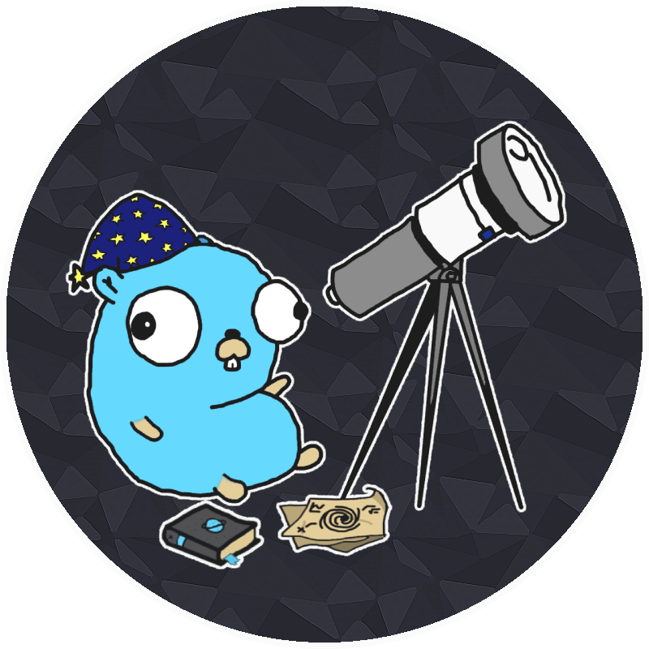
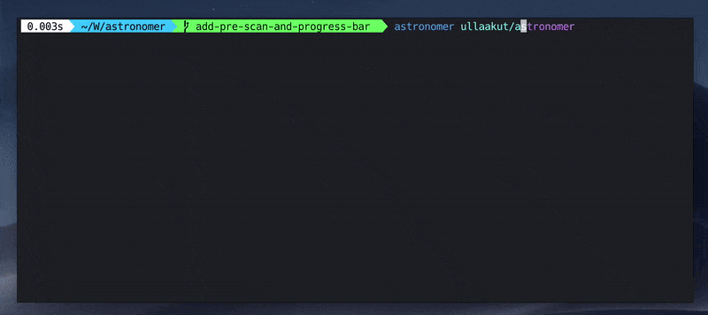
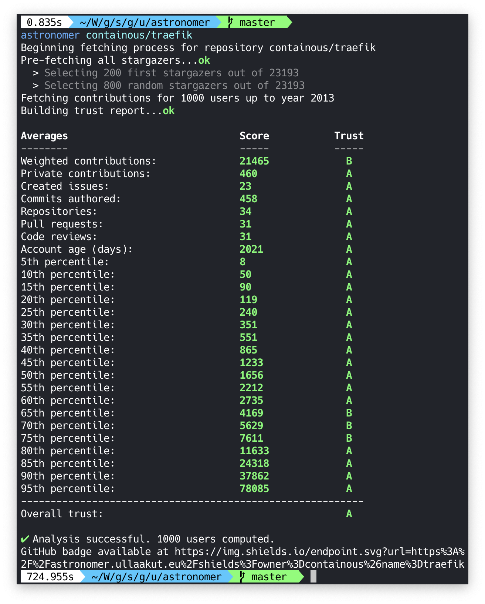
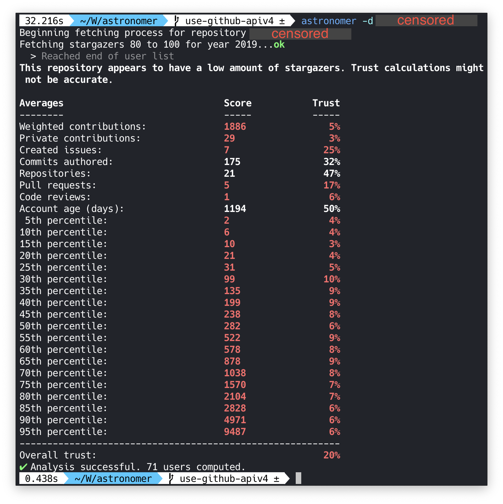
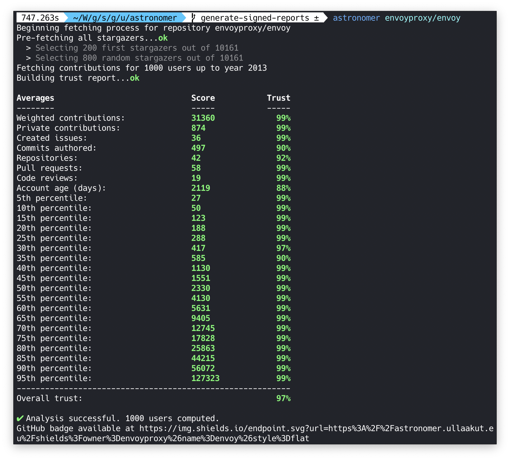

# Astronomer

    

    
    
    
    

Astronomer is a tool that fetches data from every GitHub user who starred a common repository and computes how likely it is that those users are real humans.
The goal of Astronomer is to **detect illegitimate GitHub stars from bot accounts**, which could be used to artificially increase the popularity of an open source project.

    

## Trust algorithm

Trust is computed based on many different factors:

* The average amount of lifetime contributions among stargazers
* The average amount of private contributions
* The average amount of public created issues
* The average amount of public authored commits
* The average amount of public opened pull requests
* The average amount of public code reviews
* The average weighted contribution score (weighted by making older contributions more trustworthy)
* Every 5th percentile, from 5 to 95, of the weighted contribution score
* The average account age, older is more trustworthy

## How to use it

### Docker image

In order to use Astronomer, you'll need a GitHub token with `repo` read rights. You can generate one [in your GitHub Settings > Developer settings > Personal Access Tokens](https://github.com/settings/tokens). Make sure to keep this token secret. You will also need to have docker installed.

Run `docker pull ullaakut/astronomer`.

Then, use the astronomer docker image like such: `docker run -t -e GITHUB_TOKEN=$GITHUB_TOKEN -v "/path/to/your/cache/folder:/data/" ullaakut/astronomer repositoryOwner/repositoryName --verbose`

* The `-t` flag allows you to get a colored output. You can remove it from the command line if you don't care about this.
* The `-e GITHUB_TOKEN=<your_token>` option is mandatory. The GitHub API won't authorize any requests without it.
* The `-v "/path/to/your/cache/folder:/data/"` option can be used to cache the responses from the GitHub API on your machine. This means that the next time you run a scan, Astronomer will simply update its cache with the new stargazers since your last scan, and compute the trust levels again. It is highly recommended to use cache if you plan on scanning popular repositories (more than 1000 stars) more than once.
* The `--verbose` flag enables the verbose mode which displays more detailed logs.

### Binary

You can also install the go binary by [enabling go modules](https://github.com/golang/go/wiki/Modules#how-to-use-modules) and running `go install github.com/ullaakut/astronomer`. Make sure that your `go` version is at least `1.11.x`.

You can verify your `go` version by running `go version`.

The `astronomer` binary will then be available in `$GOPATH/bin/astronomer`.

## Arguments and options

* It is required to specify a repository in the form `repositoryOwner/repositoryName`. This argument's position does not matter.
* **`-c, --cachedir` (string)**: Set the directory in which to store cache data (default: `./data`)
* **`-s, --stars`**: Set the maxmimum amount of stars to scan (default: `1000`)
* **`-a, --all`**: Scan all stargazers. This option overrides the `--stars` option, and it is not recommended as it might take hours (default: `false`)
* **`--verbose`**: Show extra logs, such as comparative reports and debug logs (default: `false`)

## Upcoming features

In the future, Astronomer will hopefully:

* Generate GitHub badges to show off that your repository is legit (thanks [@emilevauge](https://github.com/emilevauge) for the idea!)
* Provide a web interface to request scans and get your badge

Keep in mind that scans are always going to be long for huge repositories. A 10K+ stars repository will take multiple hours to scan.

## Examples

    

    

    

## Questions & Answers

> _How accurate is this algorithm? Why does my repository have a low trust level?_

Astronomer only attempts to estimate a trust level. The more stargazers there are on a repository, the more accurate it will be. Since the algorithm compares averages of the scanned repositories with global averages, if your repository has only two stars and that both are from new accounts with low contributions, it will seem extremely fishy to Astronomer, even if those are probably real stars. The goal of Astronomer is more orentied towards popular projects with thousands of stars, where the first few hundreds might have been from bot accounts, used to boost the project's popularity.

> _Why would fake stars be an issue? The number of stars doesn't really matter._

Repositories with high amounts of stars, especially when they arrive in bursts, are often found in [GitHub trending](https://github.com/trending), they are also emailed to people who subscribed to the [GitHub Explore](https://github.com/explore?since=daily) daily newsletter. This means that an open source project can get actual users to use their software by bringing attention to it using illegitimate bot accounts. Many startups are known for choosing technologies to use based on GitHub stars, since they provide the comforting thought that the project is backed by a strong community. Unfortunately, as far as I know, GitHub currently does not attempt to prevent this from happening.

> _How can I contribute to this project?_

If you have a strong math background, knowledge in statistics and analytics, or in general believe you could make the trust algorithm smarter, please contact me, or at least feel free to open a feature request describing what algorithm you think would work better. A feature that I would be especially interested in is computing the curve of percentile values for each trust factor and compare it to a reference curve, in order to detect inconsistencies.

If you are a software engineer or a web developer (or both), you could also participate in helping to build the next version of Astronomer: an API and a web application to let people scan whatever repositories they want for fake stars, and see previously generated reports through a web interface. It would make it easy for everyone to check whether or not a repository's stargazers are legit.

Also, if you have data to backup a claim that you have a better value for the good/bad constants (used to determine what is a good or bad value for a specific metric), feel free to reach out to me. This is an essential part of having a precise estimation of how legit a repository is, and improving these constants would improve the overall quality of the algorithm.

> _What's the strange hardcoded skip in the `query.go` file?_

Unfortunately there was an issue in the GitHub API, where all API queries containing [this user](https://github.com/jstrachan)'s contributions consistenly timed out. Since he starred `containous/traefik`, I had to hardcode a skip in order to allow the scan to continue (since the GH API's only method of pagination is to use the `cursor` returned by the user node, get his cursor value manually and hardcode it in the blacklist. It has since been solved by GitHub but I'm keeping this logic in place in case it's ever needed again.

## Thanks

Thanks to the authors of [spencerkimball/stargazers](https://github.com/spencerkimball/stargazers) who greatly inspired the early design of this project 🙏

The original Go gopher was designed by [Renee French](http://reneefrench.blogspot.com).

## License

Copyright 2019 Ullaakut

Permission is hereby granted, free of charge, to any person obtaining a copy of this software and associated documentation files (the "Software"), to deal in the Software without restriction, including without limitation the rights to use, copy, modify, merge, publish, distribute, sublicense, and/or sell copies of the Software, and to permit persons to whom the Software is furnished to do so, subject to the following conditions:

The above copyright notice and this permission notice shall be included in all copies or substantial portions of the Software.

THE SOFTWARE IS PROVIDED "AS IS", WITHOUT WARRANTY OF ANY KIND, EXPRESS OR IMPLIED, INCLUDING BUT NOT LIMITED TO THE WARRANTIES OF MERCHANTABILITY, FITNESS FOR A PARTICULAR PURPOSE AND NONINFRINGEMENT. IN NO EVENT SHALL THE AUTHORS OR COPYRIGHT HOLDERS BE LIABLE FOR ANY CLAIM, DAMAGES OR OTHER LIABILITY, WHETHER IN AN ACTION OF CONTRACT, TORT OR OTHERWISE, ARISING FROM, OUT OF OR IN CONNECTION WITH THE SOFTWARE OR THE USE OR OTHER DEALINGS IN THE SOFTWARE.
