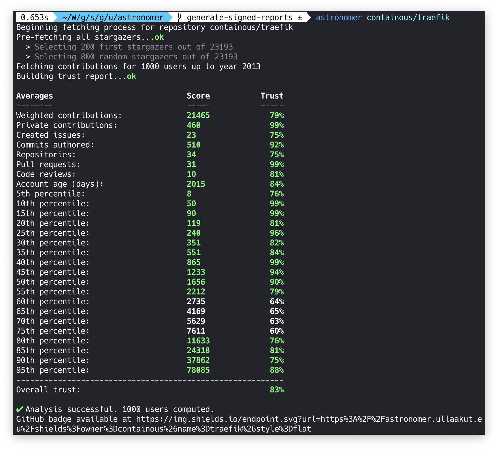

# Astronomer

<p align="center">
    
</p>

<p align="center">
    <a href="https://github.com/ullaakut/astronomer">
        
    </a>
    <a href="#license">
        
    </a>
    <a href="https://hub.docker.com/r/ullaakut/astronomer/">
        
    </a>
    <a href="https://goreportcard.com/report/github.com/ullaakut/astronomer">
        
    </a>
    <a href="https://github.com/ullaakut/astronomer/releases/latest">
        
    </a>
</p>

Astronomer is a tool that fetches data from every GitHub user who starred a common repository and computes how likely it is that those users are real humans.
The goal of Astronomer is to **detect illegitimate GitHub stars from bot accounts**, which could be used to artificially increase the popularity of an open source project.

It comes together with [Astrolab](https://github.com/ullaakut/astrolab), a server which collects trust reports generated by Astronomer, and **generates GitHub badges** to let you prove your community's authenticity.

<p align="center">
    
</p>

## Trust algorithm

Trust is computed based on many different factors:

* The average amount of lifetime contributions among stargazers
* The average amount of private contributions
* The average amount of public created issues
* The average amount of public authored commits
* The average amount of public opened pull requests
* The average amount of public code reviews
* The average weighted contribution score (weighted by making older contributions more trustworthy)
* Every 5th percentile, from 5 to 95, of the weighted contribution score
* The average account age, older is more trustworthy

## How to use it

In order to use Astronomer, you'll need a GitHub token with `repo` read rights. You can generate one [in your GitHub Settings > Developer settings > Personal Access Tokens](https://github.com/settings/tokens). Make sure to keep this token secret.

### Docker image

Run `docker pull ullaakut/astronomer`.

Then, use the astronomer docker image like such: `docker run -t -e GITHUB_TOKEN=$GITHUB_TOKEN -v "/path/to/your/cache/folder:/data/" ullaakut/astronomer repositoryOwner/repositoryName`

* The `-t` flag allows you to get a colored output. You can remove it from the command line if you don't care about this.
* The `-e GITHUB_TOKEN=<your_token>` option is mandatory. The GitHub API won't authorize any requests without it.
* The `-v "/path/to/your/cache/folder:/data/"` option can be used to cache the responses from the GitHub API on your machine. This means that the next time you run a scan, Astronomer will simply update its cache with the new stargazers since your last scan, and compute the trust levels again. It is highly recommended to use cache if you plan on scanning popular repositories (more than 1000 stars) more than once.

### Binary

You can also download pre-compiled go binaries from the [Astronomer releases](https://github.com/Ullaakut/astronomer/releases/latest).

For the following commands, if you don't have a `$GOPATH`, feel free to replace the path of destination with what works best for you. (For example, `/usr/local/bin`)

There are no dependencies, since astronomer comes as a statically built binary.

#### Linux

> AMD64

```bash
curl -o $GOPATH/bin/astronomer -sSLO https://github.com/Ullaakut/astronomer/releases/download/v1.1.2/astronomer-linux-amd64
```

> ARM

```bash
curl -o $GOPATH/bin/astronomer -sSLO https://github.com/Ullaakut/astronomer/releases/download/v1.1.2/astronomer-linux-arm
```

> 386

```bash
curl -o $GOPATH/bin/astronomer -sSLO https://github.com/Ullaakut/astronomer/releases/download/v1.1.2/astronomer-linux-386
```

#### MacOS

```bash
curl -o $GOPATH/bin/astronomer -sSLO https://github.com/Ullaakut/astronomer/releases/download/v1.1.2/astronomer-darwin-amd64
```

#### Windows

Download [this file](https://github.com/Ullaakut/astronomer/releases/download/v1.1.2/astronomer-windows-386.exe), rename it to `astronomer` and add it to your path.

## Arguments and options

* It is required to specify a repository in the form `repositoryOwner/repositoryName`. This argument's position does not matter.
* **`-c, --cachedir` (string)**: Set the directory in which to store cache data (default: `./data`)
* **`-s, --stars`**: Set the maxmimum amount of stars to scan (default: `1000`)
* **`-a, --all`**: Scan all stargazers. This option overrides the `--stars` option, and it is not recommended as it might take hours (default: `false`)
* **`-v, --verbose`**: Show extra logs, such as comparative reports and debug logs (default: `false`)

## Upcoming features

In the future, Astronomer will have a web application to display the detailed trust reports of repositories, which will then be the link of choice to put on your badge. It will also allow you to quickly look through all of the scanned repositories and access their full trust reports.

Also, Astrolab will receive many improvements in the near future, in order to gather more accurate data by having multiple reports for the same repositories for example.

## Examples

<p align="left">
    
</p>
<p align="left">
    &puncsp;&puncsp;&puncsp;&puncsp;&puncsp;&puncsp;&puncsp;&puncsp;&puncsp;&puncsp;&puncsp;&puncsp;&puncsp;&puncsp;&puncsp;&puncsp;&puncsp;&puncsp;&puncsp;&puncsp;&puncsp;&puncsp;&puncsp;&puncsp;&puncsp;&puncsp;&puncsp;&puncsp;&puncsp;&puncsp;&puncsp;&puncsp;&puncsp;&puncsp;&puncsp;&puncsp;&puncsp;&puncsp;&puncsp;&puncsp;&puncsp;&puncsp;
    
</p>
<p align="right">
    
</p>
<p align="right">
    
    &puncsp;&puncsp;&puncsp;&puncsp;&puncsp;&puncsp;&puncsp;&puncsp;&puncsp;&puncsp;&puncsp;&puncsp;&puncsp;&puncsp;&puncsp;&puncsp;&puncsp;&puncsp;&puncsp;&puncsp;&puncsp;&puncsp;&puncsp;&puncsp;&puncsp;&puncsp;&puncsp;&puncsp;&puncsp;&puncsp;&puncsp;&puncsp;&puncsp;&puncsp;&puncsp;&puncsp;&puncsp;&puncsp;&puncsp;&puncsp;&puncsp;&puncsp;
</p>
<p align="left">
    
</p>
<p align="left">
    &puncsp;&puncsp;&puncsp;&puncsp;&puncsp;&puncsp;&puncsp;&puncsp;&puncsp;&puncsp;&puncsp;&puncsp;&puncsp;&puncsp;&puncsp;&puncsp;&puncsp;&puncsp;&puncsp;&puncsp;&puncsp;&puncsp;&puncsp;&puncsp;&puncsp;&puncsp;&puncsp;&puncsp;&puncsp;&puncsp;&puncsp;&puncsp;&puncsp;&puncsp;&puncsp;&puncsp;&puncsp;&puncsp;&puncsp;&puncsp;&puncsp;&puncsp;
    
</p>

## Questions & Answers

> _Why would fake stars be an issue? The number of stars doesn't really matter._

Repositories with high amounts of stars, especially when they arrive in bursts, are often found in [GitHub trending](https://github.com/trending), they are also emailed to people who subscribed to the [GitHub Explore](https://github.com/explore?since=daily) daily newsletter. This means that an open source project can get actual users to use their software by bringing attention to it using illegitimate bot accounts. Many startups are known for choosing technologies to use based on GitHub stars, since they provide the comforting thought that the project is backed by a strong community. Unfortunately, as far as I know, GitHub currently does not attempt to prevent this from happening.

<br/>

> _How accurate is this algorithm? Why does my repository have a low trust level?_

Astronomer only attempts to estimate a trust level. A low score could be indicative of a community of casual GitHub users, or a repisitory with a low amount of stars resulting in low precisions.

<br/>

> _How can I add an Astronomer badge to my repository?_

Once you run an Astronomer scan on your machine, your trust report is automatically sent to the Astronomer server. Then, a link to your badge should be visible in Astronomer's output. Once you have it, you can add it to your repository by simply adding this line to your repository's `README.md` file:

`[](https://github.com/ullaakut/astronomer)`

Make sure to replace `<REPOSITORY_OWNER>` and `<REPOSITORY_NAME>` with the correct values for your repository. For example, for astronomer, the URL would be `https://img.shields.io/endpoint.svg?url=https%3A%2F%2Fastronomer.ullaakut.eu%2Fshields%3Fowner%3Dullaakut%26name%3Dastronomer`.

<br/>

> _I ran multiple scans of my repository and I'm getting slightly different trust ratios every time, why is that?_

In order to be faster, Astronomer does not scan every single user in your repository. It instead scans the early stargazers of your repository and compares their trust levels to multiple slices of random stargazers of your repository. Those random stargazers can then sometimes be responsible for slight changes in the results, but they usually represent a difference of 1% to 3%, which is negligeable.

If you want a very precise report of all of your stargazers, use the `--all` option. This will scan all of your stargazer and completely remove the random factor.

<br/>

> _How can I contribute to this project?_

Simply running Astronomer on as many GitHub projects as possible (especially those with over 1000 stars) is very helpful for us, as it gives us more data in order to refine the algorithm.

Also, if you have a strong math background, knowledge in statistics and analytics, or in general believe you could make the trust algorithm smarter, please contact me, or at least feel free to open a feature request describing what algorithm you think would work better. A feature that I would be especially interested in is computing the curve of percentile values for each trust factor and compare it to a reference curve, in order to detect inconsistencies.

Of course, if you have any suggestion of features or improvements you would like to see in Astronomer, feel free to open issues and pull requests!

## Thanks

Thanks to the authors of [spencerkimball/stargazers](https://github.com/spencerkimball/stargazers) who greatly inspired the early design of this project 🙏

The original Go gopher was designed by [Renee French](http://reneefrench.blogspot.com).

## License

Copyright 2019 Ullaakut

Permission is hereby granted, free of charge, to any person obtaining a copy of this software and associated documentation files (the "Software"), to deal in the Software without restriction, including without limitation the rights to use, copy, modify, merge, publish, distribute, sublicense, and/or sell copies of the Software, and to permit persons to whom the Software is furnished to do so, subject to the following conditions:

The above copyright notice and this permission notice shall be included in all copies or substantial portions of the Software.

THE SOFTWARE IS PROVIDED "AS IS", WITHOUT WARRANTY OF ANY KIND, EXPRESS OR IMPLIED, INCLUDING BUT NOT LIMITED TO THE WARRANTIES OF MERCHANTABILITY, FITNESS FOR A PARTICULAR PURPOSE AND NONINFRINGEMENT. IN NO EVENT SHALL THE AUTHORS OR COPYRIGHT HOLDERS BE LIABLE FOR ANY CLAIM, DAMAGES OR OTHER LIABILITY, WHETHER IN AN ACTION OF CONTRACT, TORT OR OTHERWISE, ARISING FROM, OUT OF OR IN CONNECTION WITH THE SOFTWARE OR THE USE OR OTHER DEALINGS IN THE SOFTWARE.
