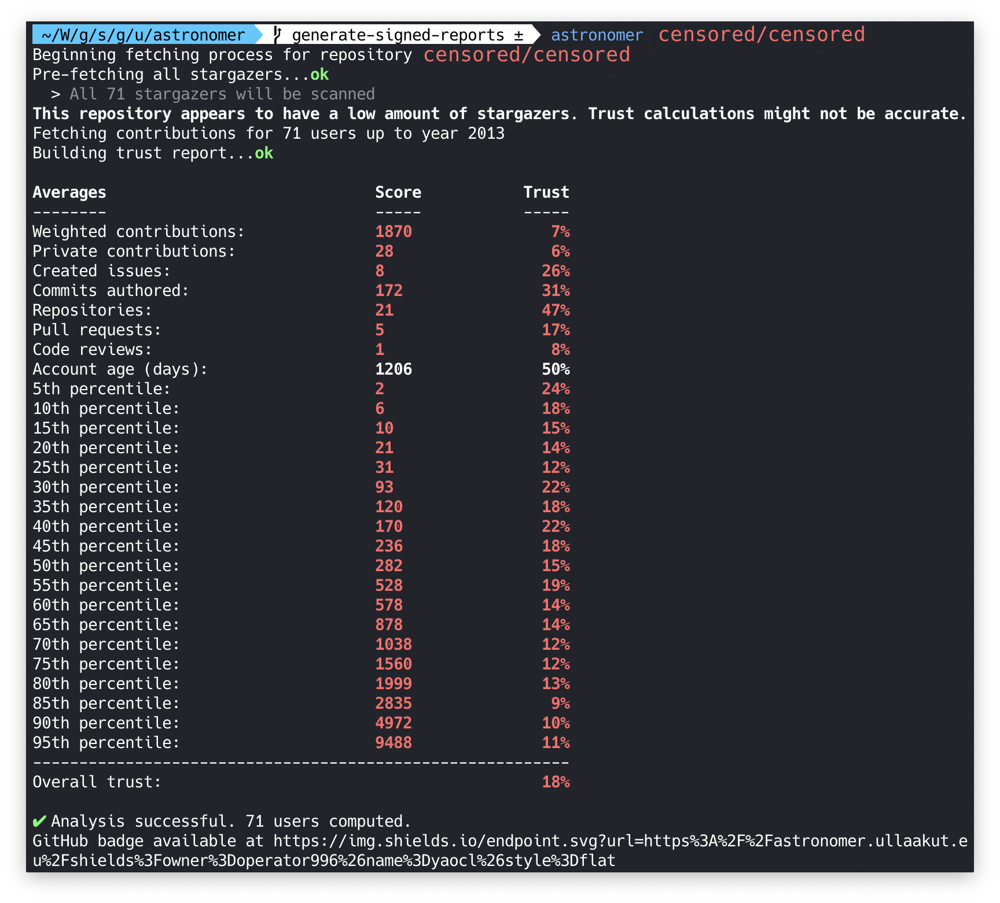

# Astronomer

    

    
    
    

Astronomer is a tool to fetch data from every GitHub user who starred a common repository and compute how likely it is that those users are real humans.
The goal of this tool is to **detect illegitimate GitHub stars from bot accounts**, which could be used to artificially increase the popularity of an open source project.

## Trust algorithm

Trust is computed based on many different factors:

* The average amount of lifetime contributions among stargazers
* The average amount of private contributions
* The average amount of public created issues
* The average amount of public authored commits
* The average amount of public opened pull requests
* The average amount of public code reviews
* The average weighted contribution score (weighted by making older contributions more trustworthy)
* The average account age, older is more trustworthy

### Upcoming improvements

I am planning on soon also computing every 5th percentile (`5`, `10`, `15` and so on) and try to detect any irregularity. This would mean that if at least 5% of the total stars are fake, they should result in an anomaly in at least one of those percentile values. It will be difficult to make this a precise estimation however, so it will not be available in the first version of Astronomer.

## Examples

    

    

    

## How to use it

In order to use Astronomer, you'll need a GitHub token with `repo` read rights. You can generate one [in your GitHub Settings > Developer settings > Personal Access Tokens](https://github.com/settings/tokens). Make sure to keep this token secret. You will also need to have docker installed.

Run `docker pull ullaakut/astronomer`.

Then, use the astronomer docker image like such: `docker run -t -e GITHUB_TOKEN=$GITHUB_TOKEN -v "/path/to/your/cache/folder:/data/" ullaakut/astronomer myusername/myrepository`

* The `-t` flag allows you to get a colored output. You can remove it from the command line if you don't care about this.
* The `-e GITHUB_TOKEN=<your_token>` option is mandatory. The GitHub API won't authorize any requests without it.
* The `-v "/path/to/your/cache/folder:/data/"` option can be used to cache the responses from the GitHub API on your machine. This means that the next time you run a scan, Astronomer will simply update its cache with the new stargazers since your last scan, and compute the trust levels again. It is highly recommended to use cache if you plan on scanning popular repositories (more than 1000 stars) more than once.

## Questions & Answers

> _How accurate is this algorithm? Why does my repository has a low trust level?_

Astronomer only attempts to estimate a trust level. The more stargazers there are on a repository, the more accurate it will be. Since the algorithm compares averages of the scanned repositories with global averages, if your repository has only two stars and that both are from new accounts with low contributions, it will seem extremely fishy to Astronomer, even if those are probably real stars. The goal of Astronomer is more orentied towards popular projects with thousands of stars, where the first few thousands might have been from bot accounts, used to boost the project's popularity.

> _Why would fake stars be an issue? The number of stars doesn't really matter._

Repositories with high amounts of stars, especially when they arrive in bursts, are often found in [GitHub trending](https://github.com/trending), they are also emailed to people who subscribed to the [GitHub Explore](https://github.com/explore?since=daily) daily newsletter. This means that an open source project can get actual users to use their software by bringing attention to it using illegitimate bot accounts. Unfortunately, as far as I know, GitHub currently does not attempt to prevent this from happening.

> _Why is `Astronomer` so slow? It's been scanning a project for hours._

Astronomer needs to make a lot of queries to the GitHub API in order to fetch all of the user data. It typically needs to do one request per page of stargazers per year of contributions, (as of 2019 that's 11 requests per 30 users). The issue is that the GitHub API is rate limited to 5000 requests per hour, so for a scan of 25000 stars for example, about 9000 requests are required, which will result in at least a two hour scan. I plan on contacting GitHub to try to get a token with more flexible rate limiting, since I believe this project is beneficial to their business, but I'm not confident this request will be accepted.

> _How can I contribute to this project?_

If you have a strong math background, knowledge in statistics and analytics, or in general believe you could make the trust algorithm smarter, please contact me, or at least feel free to open a feature request describing what algorithm you think would work better.

If you are a software engineer or a web developer (or both), you could also participate in helping to build the next version of Astronomer: an API and a web application to let people scan whatever repositories they want for fake stars, and see previously generated reports through a web interface. It would make it easy for everyone to check whether or not a repository's stargazers are legit.

Also, if you have data to backup a claim that you have a better value for the good/bad constants (used to determine what is a good or bad value for a specific metric), feel free to reach out to me. This is an essential part of having a precise estimation of how legit a repository is, and improving these constants would improve the overall quality of the algorithm.

> _What is the end goal of this project?_

Ideally, this should be a GitHub feature. The issue is that it's actually almost impossible to differentiate a bot account and the account of someone who just created a GH account to star a repository and show their support, which can lead to angry customers for GitHub if they chose to ban potentially illegitimate accounts. It's also very easy for people who make bot accounts to make them seem legit by creating private repositories with daily contributions, but this can also be detected to some extent, if it's a trend that ends up appearing.

## Thanks

Thanks to the authors of [spencerkimball/stargazers](https://github.com/spencerkimball/stargazers) 🙏

## License

Copyright 2019 Ullaakut

Permission is hereby granted, free of charge, to any person obtaining a copy of this software and associated documentation files (the "Software"), to deal in the Software without restriction, including without limitation the rights to use, copy, modify, merge, publish, distribute, sublicense, and/or sell copies of the Software, and to permit persons to whom the Software is furnished to do so, subject to the following conditions:

The above copyright notice and this permission notice shall be included in all copies or substantial portions of the Software.

THE SOFTWARE IS PROVIDED "AS IS", WITHOUT WARRANTY OF ANY KIND, EXPRESS OR IMPLIED, INCLUDING BUT NOT LIMITED TO THE WARRANTIES OF MERCHANTABILITY, FITNESS FOR A PARTICULAR PURPOSE AND NONINFRINGEMENT. IN NO EVENT SHALL THE AUTHORS OR COPYRIGHT HOLDERS BE LIABLE FOR ANY CLAIM, DAMAGES OR OTHER LIABILITY, WHETHER IN AN ACTION OF CONTRACT, TORT OR OTHERWISE, ARISING FROM, OUT OF OR IN CONNECTION WITH THE SOFTWARE OR THE USE OR OTHER DEALINGS IN THE SOFTWARE.
